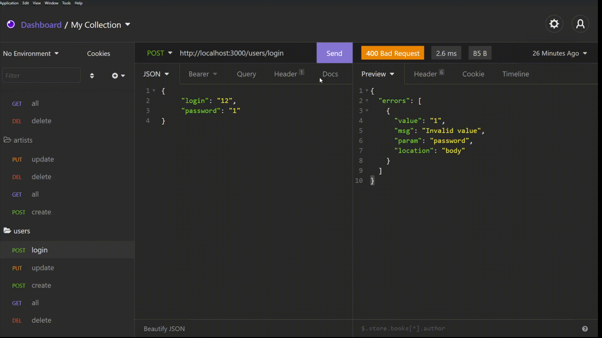
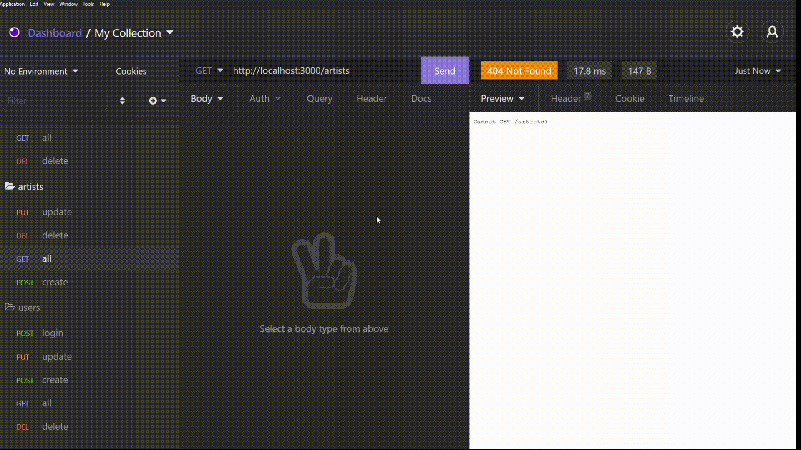

# REST API NODE.JS

## Приклади роботи програми

# Функціонал звичайного користувача
Можливість створення користувача
https://user-images.githubusercontent.com/47476224/132131667-5d70d768-cbc4-473f-9eea-2d75f8ef5a45.mp4

Можливість авторизації з перевіркою данних

Можливість перегляжу всіх виконавці, жанрів та альбомів

Можливість перегляду альбомів за виконавцем та за жанорм

# Функціонал адміністратора
