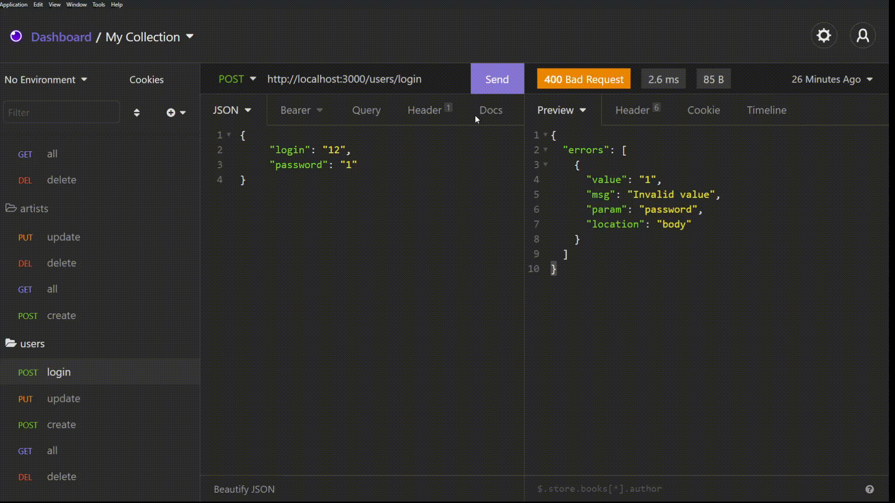
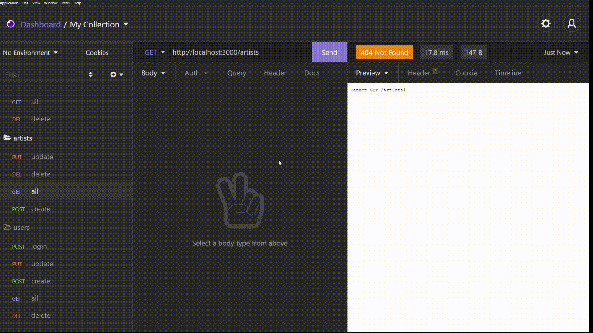

# REST API NODE.JS

## Приклади роботи програми

# Функціонал звичайного користувача
Можливість створення користувача

Можливість авторизації з перевіркою данних

Можливість перегляжу всіх виконавці, жанрів та альбомів

Можливість перегляду альбомів за виконавцем та за жанорм

# Функціонал адміністратора
